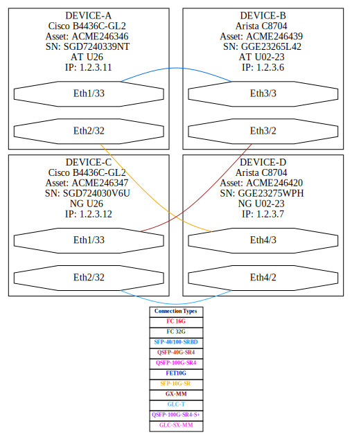
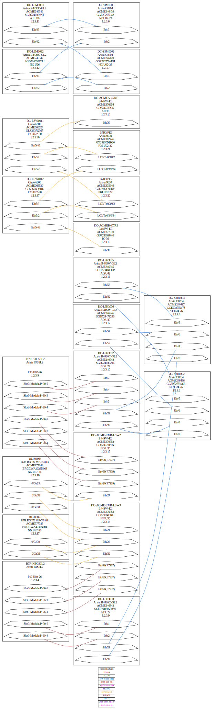

# E2NDConverter (ExcelToNetworkDiagramConverter)

Do you need to keep track of all the interfaces that your systems connect to? And also have them available in diagram form? You can use the ExcelToNetworkDiagramConverter (E2NDConverter) to create Scalable Vector Graphics (SVG) files which can be imported directly into Visio and further manipulated directly in Visio as required. This method, of converting an Excel to a Network Diagram can save you hours and hours of work by simply defining in Excel what device and ports you want connected, and having them show up in diagram format! 

As a bonus, you can also keep track of Serial Numbers, IP addresses, device Location and any other asset information that may be specific to your organization, which is built-in to the diagram and Excel file for easy tracking and documentation.

## Acknowledges

Special thanks to Salman Naqvi, who did most of the work on this project, including preparing the raw data and verifying the results. Without his knowledge, this tool would not have been implemented.

## Usage

```bash
python e2ndconverter.py demo.xlsx [demo.dot] [demo.svg] [LR|TB]
```

Most of the above command is self-explanatory. demo.xlsx is the input Excel file which has the connection details. 
See attached example. demo.dot is the Graphviz dot format file, which you can manipulate as required, in case you prefer to work directly with Graphviz, and if you don’t know what Graphviz is, you can simply ignore this file. Demo.svg is the main output of this script, the diagram. The LR option, which is the default, creates diagrams that are vertical and TB option creates diagrams that are horizontal.

## Installation

```bash
$ git clone https://github.com/dukkee/excel-to-network-diagram-converter.git
$ cd excel-to-network-diagram-converter
$ pip install -r requirements.txt
```

## Requirements

Python 2.X/3.X

Converter has a [graphviz](https://graphviz.org/) dependency:
- [Windows](https://forum.graphviz.org/t/new-simplified-installation-procedure-on-windows/224)
- [Linux](https://graphviz.org/download/#linux)
- [Mac](https://graphviz.org/download/#mac)

## Dynamic Clickable Diagram

Now with SVG file in the same directory you will get an additional `page.html` file with `static` folder of 
dependencies. You can open this page in your browser directly or run simple Python or any other web server to serve this page.

## Video Demonstration

Check out a demonstration, tutorial and use cases of this tool [here on YouTube](https://www.youtube.com/watch?v=SeFb1XfDo1Y)

## Examples

In [examples](https://github.com/dukkee/excel-to-network-diagram-converter/tree/master/examples) directory you will 
find source tables and generated results for the next schemas:
 



